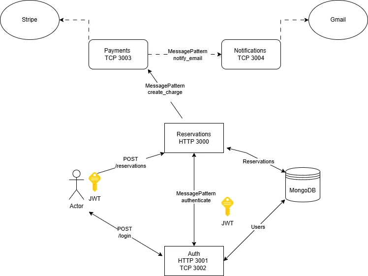

# SLEEPR API Microservice

## Overview

The SLEEPR API Microservice is a scalable microservices-based backend for the **SLEEPR** project, handling user authentication, reservations, payments, and notifications. It utilizes NestJS to structure services as distinct, containerized modules that communicate via RESTful and TCP protocols. Each service is deployed independently, allowing for easy scalability and maintenance.

## Architecture Diagram



### Services and Responsibilities

1. **Reservations Service (HTTP 3000)**:
   - Main entry point for creating and managing reservations.
   - Handles `/reservations` POST requests for booking creation.
   - Communicates with:
     - **Auth Service** to authenticate users via a JWT.
     - **Payments Service** to process payments for reservations.

2. **Auth Service (HTTP 3001 / TCP 3002)**:
   - Manages user authentication with JWT tokens.
   - Exposes a `/login` endpoint for generating JWTs.
   - Provides `authenticate` message patterns for validating tokens across services.

3. **Payments Service (TCP 3003)**:
   - Integrates with Stripe to process payments.
   - Receives `create_charge` messages from the Reservations Service.
   - Communicates with **Notifications Service** to trigger email notifications on payment success.

4. **Notifications Service (TCP 3004)**:
   - Handles email notifications via Gmail.
   - Listens for `notify_email` messages from the Payments Service to send receipts and confirmations.

5. **MongoDB Database**:
   - Central storage for user data and reservations.
   - Connected to both the **Auth** and **Reservations** services to persist data.

## Prerequisites

- **Node.js** and **pnpm** for package management.
- **Docker** for containerized deployment.
- **MongoDB** as the main data store.
- **Stripe** for handling payments.
- **Gmail** for notification services.


## Getting Started

### Installation

Clone the repository and install dependencies:

```bash
$ pnpm install
```

### Environment Setup

Create a `.env` file in the root directory to configure environment variables for each service, such as database URI, Stripe API keys, and Gmail credentials.

### Running the Services

Each service can be started individually, depending on the environment:

```bash
# Start Reservations service (HTTP 3000)
$ pnpm run start:reservations

# Start Auth service (HTTP 3001 / TCP 3002)
$ pnpm run start:auth

# Start Payments service (TCP 3003)
$ pnpm run start:payments

# Start Notifications service (TCP 3004)
$ pnpm run start:notifications
```

For development mode with hot reloading:

```bash
$ pnpm run start:dev
```

For production mode:

```bash
$ pnpm run start:prod
```

### Docker Setup

A Docker Compose file can be added to facilitate running all services and dependencies like MongoDB in containers. This allows for seamless integration and scalable deployment.

## Testing

The project includes testing scripts for unit, end-to-end (e2e), and coverage testing.

```bash
# Unit tests
$ pnpm run test

# End-to-end tests
$ pnpm run test:e2e

# Coverage report
$ pnpm run test:cov
```

## API Endpoints

- **Reservations Service**: `POST /reservations` - Creates a new reservation. Requires a valid JWT.
- **Auth Service**: `POST /login` - Authenticates user credentials and issues a JWT.

### Message Patterns

- **Auth Service**: `authenticate` - Validates JWT for inter-service requests.
- **Reservations Service**: `create_charge` - Initiates payment processing.
- **Payments Service**: `notify_email` - Triggers email notifications.

## Technology Stack

- **NestJS**: Framework for building efficient and scalable server-side applications.
- **MongoDB**: NoSQL database for storing user and reservation data.
- **Stripe**: Payment processing API.
- **Gmail API**: Email notifications for transaction confirmations.
- **JWT**: Secure user authentication across services.
- **Docker**: Containerization for easy deployment and scaling.

## Contributing

1. Fork the repository.
2. Clone the repository locally.
3. Install dependencies with `pnpm install`.
4. Create a new branch for your feature or bug fix.
5. Open a pull request with a clear description of your changes.

## License

This project is licensed under the MIT License.

---

Happy Coding!
